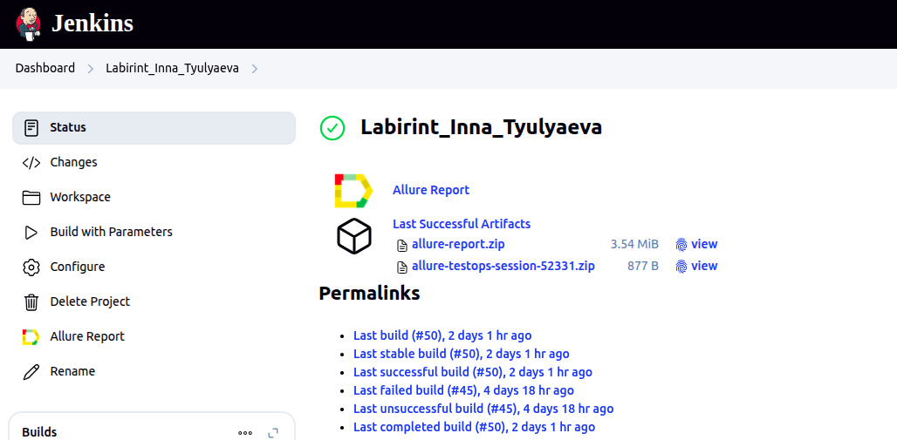
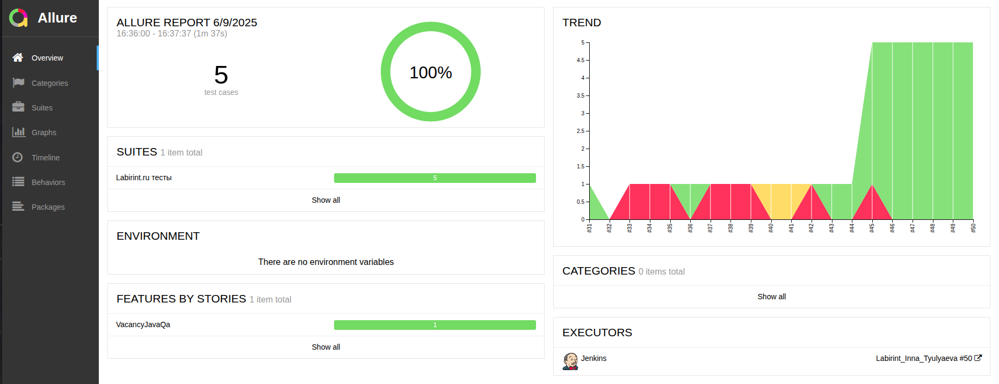
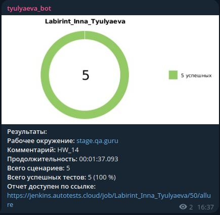
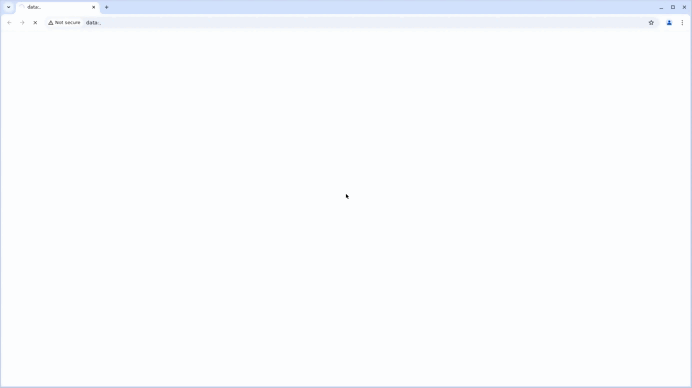

<p align="center">
  <a href="https://www.labirint.ru/">
    
  </a>
</p>

<h1 align="center">Проект по автоматизации тестирования для компании <a href="https://www.labirint.ru/">Лабиринт</a></h1>

---

## ☑️ Содержание

- [Технологии и инструменты](#tools)
- [Реализованные проверки](#cases)
- [Сборка в Jenkins и запуск из терминала](#jenkins)
- [Allure-отчёт](#allure)
- [Уведомление в Telegram](#telegram)
- [Примеры видео выполнения тестов](#video)

---

<a id="tools"></a>
<a id="tools"></a>
<h2>🛠️ Технологии и инструменты</h2>

<table>
  <tr>
    <th><a href="https://www.oracle.com/java/" target="_blank">Java</a></th>
    <th><a href="https://www.jetbrains.com/idea/" target="_blank">IntelliJ IDEA</a></th>
    <th><a href="https://github.com/" target="_blank">GitHub</a></th>
    <th><a href="https://junit.org/junit5/" target="_blank">JUnit 5</a></th>
    <th><a href="https://gradle.org/" target="_blank">Gradle</a></th>
    <th><a href="https://selenide.org/" target="_blank">Selenide</a></th>
    <th><a href="https://aerokube.com/selenoid/" target="_blank">Selenoid</a></th>
    <th><a href="https://docs.qameta.io/allure/" target="_blank">Allure Report</a></th>
    <th><a href="https://www.jenkins.io/" target="_blank">Jenkins</a></th>
    <th><a href="https://telegram.org/" target="_blank">Telegram</a></th>
  </tr>
  <tr>
    <td align="center">
      <a href="https://www.oracle.com/java/" target="_blank">
        
      </a>
    </td>
    <td align="center">
      <a href="https://www.jetbrains.com/idea/" target="_blank">
        
      </a>
    </td>
    <td align="center">
      <a href="https://github.com/" target="_blank">
        
      </a>
    </td>
    <td align="center">
      <a href="https://junit.org/junit5/" target="_blank">
        
      </a>
    </td>
    <td align="center">
      <a href="https://gradle.org/" target="_blank">
        
      </a>
    </td>
    <td align="center">
      <a href="https://selenide.org/" target="_blank">
        
      </a>
    </td>
    <td align="center">
      <a href="https://aerokube.com/selenoid/" target="_blank">
        
      </a>
    </td>
    <td align="center">
      <a href="https://docs.qameta.io/allure/" target="_blank">
        
      </a>
    </td>
    <td align="center">
      <a href="https://www.jenkins.io/" target="_blank">
        
      </a>
    </td>
    <td align="center">
      <a href="https://telegram.org/" target="_blank">
        
      </a>
    </td>
  </tr>
</table>


<a id="cases"></a>
## ✅ Реализованные проверки

- Тест-кейс №1: Проверка поиска книги.
- Тест-кейс №2: Проверка перехода в раздел 'Офисная канцелярия' с помощью меню 'Канцелярия'.
- Тест-кейс №3: Проверка просмотра карточки товара.
- Тест-кейс №4: Проверка добавления товара в корзину.
- Тест-кейс №5: Проверка смены города

---

<a id="jenkins"></a>
## 🧩 Сборка в [Jenkins](https://jenkins.autotests.cloud/job/Labirint_Inna_Tyulyaeva/)

<p align="center">
  
</p>

### ⚙️ Параметры сборки
- `task` (выборка набора тестов для запуска)
- `browser` (доступные браузеры: Chrome и Firefox)
- `browserVersion` (доступные версии Chrome: 127.0, 128.0; 
доступные версии Firefox: 124.0, 125.0)
- `browserSize` (доступные размеры окна браузера: 1920x1080, 1280x720,800x600)
- `environment` (доступное окружение: stage.usetech.ru, test.usetech.ru)
- `comment` (комментарий)
- `selenoid_remote_server` (логин, пароль и адрес удаленного сервера Selenoid)

### 🔧 Команды для запуска из терминала

**Локальный запуск**
```bash
gradle clean myshop_form
```

**Запуск с параметрами**
```bash
-Dbrowser=chrome -DbrowserSize=1920x1080 -DbrowserVersion=128.0
```

**Удалённый запуск через Jenkins**
```bash
clean
${TASK}
--info
-Dbrowser=${BROWSER}
-DbrowserVersion=${BROWSER_VERSION}
-DbrowserSize=${BROWSER_SIZE}
-DselenoidUrl=${SELENOID_URL}
-DselenoidUserLogin=${SELENOID_LOGIN}
-DselenoidUserPassword=${SELENOID_PASSWORD}
```

---

<a id="allure"></a>
## 📊 [Allure Report](https://jenkins.autotests.cloud/job/Labirint_Inna_Tyulyaeva/50/allure/)

<p align="center">
  
</p>

---

<a id="telegram"></a>
## 📩 Уведомления в Telegram

<p align="center">
  
</p>

---

<a id="video"></a>
## 🎥 Пример видео выполнения тестов (Selenoid)

<p align="center">
  
</p>
